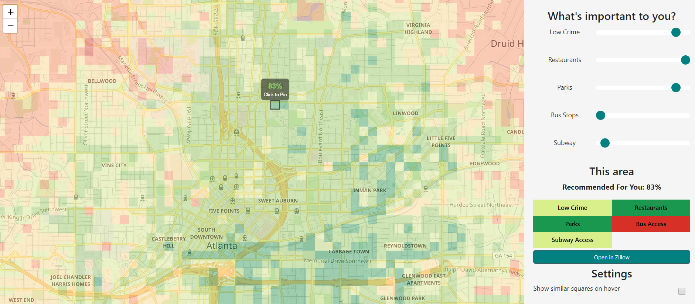

# LivingBlocks

  

LivingBlocks analyzes about 600MB of publicly available Atlanta city data (driving times, crime, restaurants, parks, subway and bus stations), and your personal preferences to create a visual recommendation of where in the city you should look for a place to live.

Altogether our data analysis pipeline racked up 60+ hours of running time for data gathering and number crunching to generate our output (combined_scores.json found in this repository). 
This frontend visualizes the final output by using D3.js alongside the Leaflet mapping library.

## Running Instructions
To run locally:
1. Clone the repository
2. Install Python
3. Host a local server using the command 'python -m http.server <port_number>'
4. Open your browser at http://localhost:<port_number>/

## Online Demo
https://benjamindupreez.github.io/living-blocks/

## Credits
LivingBlocks was created as a semester project for Prof Polo Chau's CSE6242: Data and Visual Analytics at Georgia Tech. Team Members: Botao Lee, Lee Sun, Baolin Wang, Anyu Lu, Benjamin Du Preez
